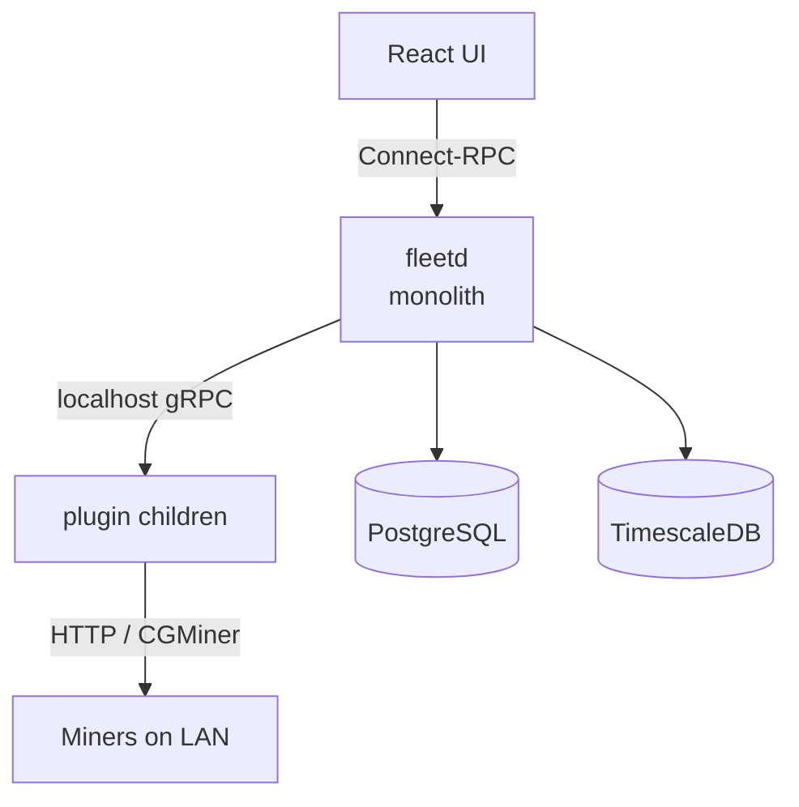
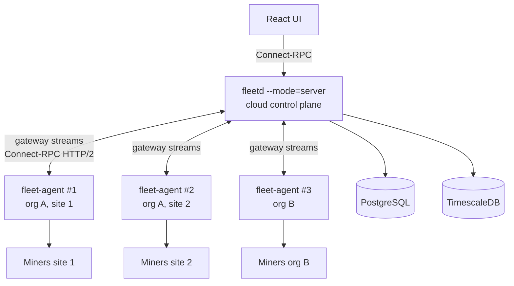

# RFC 0001: Agent + cloud-server split

- **Status**: draft
- **Author(s)**: Ankit Goswami (@ankitgoswami)
- **Created**: 2026-04-30
- **Last updated**: 2026-05-04

## Summary

Split proto-fleet into:

- An **agent** binary running on-prem next to miners. Owns plugin orchestration and miner I/O.
- A **server** running either in the cloud (managed) or on-prem in Docker. Owns API, persistence, UI, and fleet-wide state.

Multiple agents per server. Today's `fleetd` keeps a `combined` mode for backward compatibility. Behaves like Foreman/pickaxe.

## Motivation

`fleetd` ships today as one Go binary owning everything from plugin orchestration to the React UI backend. That works for "customer runs Docker on-prem" but blocks two things we want next:

1. **Hosted cloud version**. Customers want a managed proto-fleet they don't deploy themselves. Today's monolith requires Postgres + TimescaleDB on the customer's host.
2. **Air-gapped miners**. Customers don't want individual miners exposed to the internet. They need an on-prem proxy that fronts their LAN-only miners and forwards telemetry/commands to a remote control plane.

## Architecture

- The server keeps today's databases and gains a new gateway service for agents.
- The agent is a single Go binary that boots plugin children, scans for miners, polls them, and proxies telemetry and command traffic to the server.
- Combined mode keeps everything in one process for existing on-prem deployments.

Key properties:

- **Wire**: Connect-RPC over HTTP/2, with separate streams for telemetry, events, heartbeats, and server-to-agent control traffic. All streams are agent-initiated, so the cloud never needs inbound connectivity into customer networks.
- **Telemetry source of truth**: cloud TimescaleDB. The agent has a small on-disk spool for offline windows.
- **Miner I/O**: stays on the agent. The server's existing `Miner` interface gains a remote-agent adapter; command/telemetry code is unchanged.
- **UI**: served by the server only. The agent serves a tiny health page on a local port for on-site debugging.

## Strategy

Three pieces of work, in order:

- Define the wire protocol between agent and server.
- Build the agent reusing today's internal packages directly (no package reorganization yet).
- Reorganize internal packages so each binary owns its own code.

The reorganization lands:

- After multi-agent and deployment ship, so customer-visible capability isn't gated on a pure-internal PR.
- Before the SQLite/offline-buffer work, so those caches drop into the new package layout from the start.

## Drawbacks

- **Operational complexity**. Two binaries instead of one, two install paths plus the existing combined-mode docker-compose, multi-agent introduces device-ownership routing concerns.
- **WAN dependency for commands**. UI command clicks traverse the WAN twice; combined mode keeps localhost latency.
- **Enrollment and migration are interactive**. Each agent needs an operator-confirmed pairing, and migrating an org to cloud-mode requires upfront ownership-map declaration plus a Proto re-pair pass. No "walk away" flow.
- **Compromising one agent host yields the org's stored stratum credentials**. The disclosure is bounded in attack value (no payout-address change, no withdrawal). The actual hashrate-redirection blast radius is gated by the device-scoped authz invariant in any credential model. Per-agent envelope encryption tightens the disclosure boundary further and is a future option.
- **Revocation requires rotation, not just a delete**. Both the org data key and the affected credentials must be rotated; some per-device cases need manual miner recovery.

## Alternatives considered

- **Ports/adapters carve-out first**. Establish package roots and dependency direction before any wire-protocol work. Cleaner from day one, but defers customer-visible capability by weeks. We do the carve-out last instead, informed by what earlier phases revealed.
- **Federation: cloud as view aggregator only**. Each on-prem `fleetd` keeps its own DB; a cloud `fleetd` aggregates views. Rejected because (1) we want a primary cloud experience, not a secondary view, and (2) it requires every customer to keep running the on-prem Docker stack, which is exactly the operational burden a hosted offering should remove.
- **Per-secret envelope encryption** for pool/miner credentials (each row gets a fresh DEK wrapped to each authorized agent's pubkey). Rejected for v1: pool/miner credentials aren't in a class that justifies the schema and protocol surface area. The simpler per-org key gives "cloud can't decrypt at rest" without that machinery.

## Unresolved questions

- **Agent failover**. Ownership is operator-confirmed instead of being inferred from discovery races: discovery surfaces "this agent saw this device" but does not auto-claim, and the operator picks the owning agent in the UI before commands or secret bundles flow. Richer failover policies (automatic re-assignment, primary/standby pairs) are a follow-up.
- **Plugin versioning per agent**. Plugin binaries today ship in the agent installer. Self-update over the gateway is a future RFC.
- **Telemetry sampling beyond the spool window**. Today's plan drops samples after spool fills; backpressure or downsampling are alternatives, out of scope for v1.

## Authentication

- Each agent generates two ed25519 keypairs at first run: an *identity* keypair for gateway-stream proof-of-possession, and a *miner-signing* keypair for Proto miner JWTs. Each is used in exactly one signing context, so a malicious cloud cannot use one handshake as a signing oracle for the other.
- Both public keys register with the cloud at enrollment via a challenge-response flow: the agent prints its identity-pubkey fingerprint locally on first run, and the operator confirms the same fingerprint appears in the UI before the cloud issues an api_key, so a substituted-pubkey attack from a compromised cloud fails the comparison.
- Gateway streams require both a long-lived bearer api_key (authorization) and a short-lived session token minted from a unary handshake (proof-of-possession). A leaked api_key alone cannot impersonate the agent from another host.
- Device-scoped actions are gated by an `agent_device` ownership map populated only by operator-confirmed pairing; discovery never auto-claims ownership.

## Credentials

Two classes with different threat models.

### Pool and miner credentials: per-org symmetric key

- One AES-256-GCM data key per org, present on every agent in the org and never on the cloud.
- Cloud stores ciphertext; agents decrypt just-in-time.
- UI credential edits go through one online agent for encryption; the cloud holds plaintext only for the round-trip.

*Trade-off*:

- Any agent in the org can decrypt any pool/miner credential, so compromising one agent yields the org's stored credentials.
- The disclosure is bounded in attack value: stratum credentials authenticate share submission to existing pool accounts. They do not grant payout-address change or withdrawal (those are gated by separate web-UI credentials, typically 2FA, on every major pool).
- The actual hashrate-redirection vector is the agent's `UpdateMiningPools` capability, gated by the device-scoped authz invariant in any credential model.
- Beyond that authz invariant, leaked credentials for miners owned by *other* agents aren't directly exercisable either: those miners sit on their own agent's LAN, with no network path from the compromised host to reach them.
- Per-agent envelope encryption tightens the disclosure boundary further and is a future option.

*Revocation*:

- Cutting off an agent's gateway access does not invalidate the credentials it cached.
- Revocation is a workflow: rotate the org key, then rotate the affected credentials.
- Per-device credentials with no other working agent path require manual miner recovery.
- The UI tracks revocation-pending until both rotations complete.
- Operators needing immediate cutoff couple revocation with network isolation.

### Proto miner JWTs: per-agent ed25519 keys

- Each agent signs JWTs for its own miners using its miner-signing keypair. The cloud holds no signing key.
- Migration re-pairs every Proto miner with its assigned agent's pubkey while still in combined-mode, then flips to cloud-mode.
- Ownership transfer between agents is a re-pair handed off while the outgoing agent is still trusted.
- No firmware change required: the existing pair endpoint already overwrites the single authorized pubkey.

*Trade-off*:

- Closes the cloud-as-signing-oracle gap and shrinks the compromise blast radius.
- Costs: migration is heavyweight, and rotating an agent's keypair forces re-pair across every miner it owns.

*Agent reinstall*:

- *Planned same-host reinstall*: backup/restore of the key files. Miners still trust the same keypair; no re-pair needed.
- *Planned hardware swap*: `TransferAgent` before decommission, while the outgoing agent is still alive to hand miners off.
- *Unplanned loss*: manual factory-reset-and-re-pair on each affected miner. HSM-backed escrow is a future RFC.

## Phased rollout

Combined mode keeps working through every phase. Cloud-mode capability ramps up:

- **Phase 2**: single-agent.
- **Phase 3**: multi-agent.
- **Phase 4**: packaged for production deploy.
- **Phase 5**: architecturally tidy (internal package split).
- **Phase 6**: self-sufficient (offline buffer, credential edits).

| Phase | Ships | Behavior change |
| ----- | ----- | --------------- |
| 1 | Gateway proto, agent-related schema, stub handler, mode flag | None |
| 2 | Agent binary; per-org credential encryption; per-agent Proto JWT signing with re-pair migration; device-scoped authz; revocation primitives (org-data-key rotation, per-credential rotation, revocation-pending state, gateway-access cutoff); `--mode=server` skips local I/O | New deployment shape, opt-in. Single agent end-to-end with working incident-response controls |
| 3 | Multi-agent UI; visibility and transfer flows; combined-mode signer reassignment and rotation tools | Cloud-style multi-site visible |
| 4 | Cloud Dockerfile and agent installers | New install paths |
| 5 | Internal package reorganization (core/server/agent split) | None (refactor) |
| 6 | SQLite-backed caches and offline spool; UI-edit encryption proxy | Agent self-sufficient. Credential edits unblocked |

Each phase corresponds to one or a small handful of implementation PRs; design and naming details that don't change the architecture or trade-offs documented here are decided at PR review time.
