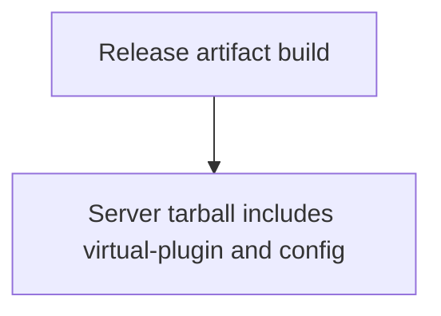
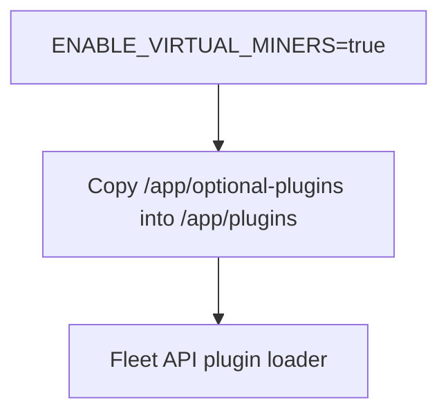

# GitHub-safe Mermaid diagrams in PR descriptions

## Problem

GitHub's Mermaid renderer rejects flowcharts that use bare quoted strings as
node identifiers:

```mermaid
flowchart TD
  "Release artifact build" --> "Server tarball includes virtual-plugin and config"
```

That form can produce a PR description error like:

```text
Unable to render rich display
Parse error ... got 'STR'
```

## Solution

Use stable node IDs with bracketed quoted labels:



For labels with punctuation, paths, environment variables, or spaces, keep the
text inside the bracketed label and keep the node ID simple:



## Prevention

- In PR descriptions, never write flowchart edges between bare quoted strings
  like `"Label" --> "Other"`.
- Always use explicit node IDs plus bracketed labels:
  `A["Label"] --> B["Other"]`.
- Keep IDs alphanumeric and short (`A`, `Build`, `PluginLoader`); put all
  reviewer-facing text in the label.
- If editing `.claude/commands/pr-describe.md` or `AGENTS.md`, preserve this
  rule in the PR-description diagram guidance.

